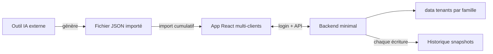
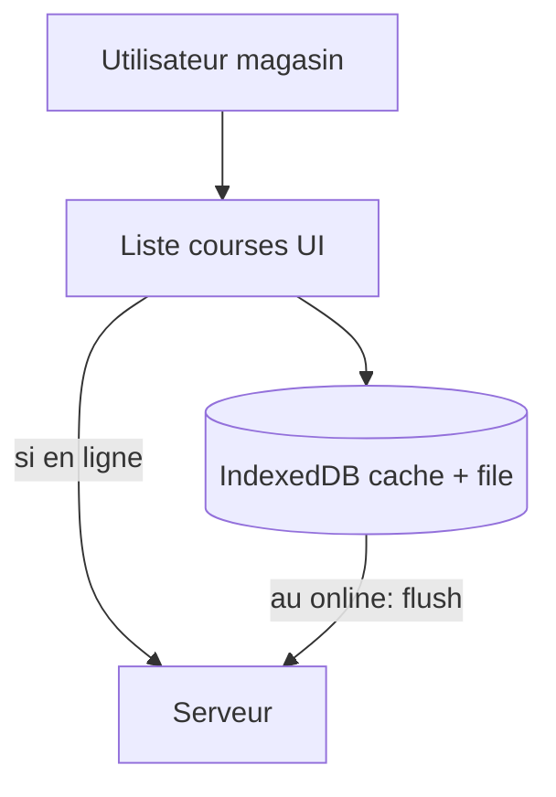

# Plan : JSON (IA) + React + synchro + stockage minimal

## Séparation des responsabilités

- **Outil 1 — IA** : produit le JSON au format contractuel (hors ce dépôt).
- **Outil 2 — cette app** : **React** + **petit serveur** qui persiste un **JSON d’état** sur disque par **famille (tenant)**, avec **historique versionné** pour limiter les pertes de données.

---

## Authentification : **un espace par login (famille)**

**Objectif** : plusieurs **foyers** peuvent utiliser la même instance (ex. NAS) avec des **données séparées**. Au sein d’un même login, **plusieurs personnes / appareils** peuvent être connectés **en même temps** : pas de limite de sessions, pas d’exclusion « un seul actif » — tous partagent le **même état** (comportement voulu : **un compte = une famille**).

**Flux simple** :

1. **Création des comptes** (V1) : fichier serveur type `data/accounts.json` (ou variables d’environnement + hash) listant `login` + `passwordHash` (**bcrypt** / **argon2**). Option : script CLI `npm run add-user` pour ajouter une famille sans UI admin complexe.
2. **Connexion** : formulaire **login + mot de passe** ; `POST /auth/login` vérifie le hash et renvoie un **JWT** (ou **cookie httpOnly** signé) contenant au minimum un `**tenantId`** stable (slug dérivé du login, ex. normalisé minuscules alphanum + tiret) — **jamais** faire confiance au login brut pour les chemins fichiers sans **slugifier** (anti path traversal).
3. **Se souvenir de moi** : case à cocher ; si cochée, **durée de vie longue** du token (ex. 30 jours) stocké en `**localStorage`** (ou cookie longue durée) ; si non, **session courte** (ex. fermeture navigateur ou 24 h) via `**sessionStorage`** ou cookie session. Préférer **httpOnly cookie** côté serveur si tu veux limiter le vol par XSS ; sinon JWT en `localStorage` reste acceptable pour un usage familial LAN avec le risque documenté.
4. **Requêtes API** : `Authorization: Bearer <token>` (ou cookie) obligatoire sur `GET/PATCH` d’état ; le serveur résout le **tenant** et lit/écrit `**data/{tenantSlug}/state.json`** uniquement.
5. **Plusieurs connexions même login** : aucune table « session unique » requise ; chaque appareil a son propre token valide en parallèle ; **conflits d’édition** restent gérés comme aujourd’hui (**version** + LWW / file offline).

**Écran** : route `/login` avant l’app ; après succès, redirection vers le tableau de bord ; bouton **déconnexion** qui efface le stockage token local.

---

## Stockage : le plus simple possible (**multi-tenant**)

- **Par famille** : un répertoire dédié, ex. `data/tenants/{tenantSlug}/state.json`, avec historique `data/tenants/{tenantSlug}/history/state-{ISO8601}-{version}.json`.
- Le fichier contient tout l’état : recettes, overrides, liste de courses, `version` / `updatedAt`.
- **À chaque sauvegarde** : écrire `state.json` + snapshot dans `history/` (rotation N fichiers).
- **Comptes** : `data/accounts.json` (ou équivalent) **à la racine data**, distinct des dossiers tenants — **ne pas** exposer ce fichier en statique.
- **Pas de SQL obligatoire** en V1 : **Express** ou **Fastify** + lecture/écriture JSON par tenant.

---

## Synchronisation multi-utilisateurs

- **Polling** (en ligne) : `GET` périodique (3–10 s ou au focus onglet) ; comparer `version` / `updatedAt` ; si plus récent, **fusionner** avec prudence si une file offline existe (voir ci-dessous).
- Mutations : `PATCH` (ou POST dédiés) **authentifiées** qui **réécrivent** le fichier du **tenant courant** + **incrémentent** la version + **créent** une snapshot.
- Conflits : **dernière écriture gagne** côté serveur ; toast optionnel si l’état distant a changé pendant que l’utilisateur était hors ligne.

---

## Liste de courses : **hors ligne** puis **synchro au retour**

**Besoin** : en magasin, la liste doit rester **utilisable sans réseau** : cocher, ajouter un produit libre, éventuellement marquer des actions ; au retour de la connexion, **pousser** les changements vers le serveur pour les autres utilisateurs.

**Approche V1 recommandée** :

1. **Cache local durable** : après chaque `GET` réussi, persister une copie de l’état (au minimum la **liste de courses** + métadonnées `version`) dans **IndexedDB** (ou équivalent) — plus fiable que `localStorage` pour un objet un peu volumineux.
2. **File d’attente de mutations** : chaque action utilisateur sur la liste (coche « acheté / déjà chez moi », **ajout** ligne manuelle, **retrait** de ligne autorisé, etc.) :
  - s’applique **immédiatement** à l’UI et au cache local ;
  - si **hors ligne** ou requête en échec, **enqueue** l’opération (type + payload + id client) dans IndexedDB.
3. **Retour en ligne** : écouter `window.online` (et retry au prochain poll) ; **rejouer** la file dans l’ordre en envoyant des `PATCH` (ou endpoint dédié « patch shopping ») avec le `**version`** attendu et le **token** du tenant ; si le serveur répond **409 / version obsolète**, refaire un `GET`, **rebaseler** le client sur le nouvel état, puis **rejouer** ou **fusionner** les ops restantes (stratégie simple : réappliquer les coches / ajouts manuels par id de ligne quand c’est possible ; sinon notifier l’utilisateur).
4. **PWA légère** : **Service Worker** (Vite PWA plugin ou manuel) pour mettre en cache le **shell** de l’app (`index.html`, JS, CSS) afin que la page **Liste de courses** s’ouvre hors ligne ; les appels API échouent proprement et basculent sur le mode file d’attente.

**Périmètre offline** : priorité **liste de courses** ; le reste (import JSON, détail recette long) peut rester « en ligne requise » en V1 ou lecture seule depuis le dernier cache si tu étends plus tard.

---

## Liste de courses : **retrait en deux étapes** (garde-fou)

Comme pour les recettes : éviter de retirer une ligne par erreur.

1. **Étape 1 — Cocher** : la ligne doit être marquée **« acheté » / « déjà à la maison »** (état `checked` ou équivalent).
2. **Étape 2 — Supprimer** : l’action **retirer de la liste** n’est **active que si** la ligne est **déjà cochée**. Sinon : bouton désactivé + message du type « Cochez d’abord la ligne ».

- **Lignes manuelles** : même règle (cocher puis supprimer), sauf décision produit d’autoriser la suppression directe des brouillons non cochés — **recommandation** : **même garde-fou partout** pour homogénéité.
- **Validation serveur** : refuser une mutation « delete line » si `checked !== true` pour la ligne concernée (anti-contournement et sync cohérente).

Les **ajouts** hors ligne restent possibles sans cette contrainte ; ils entrent dans la file et se synchronisent au retour du réseau.

---

## Identifiants : **internes** vs **fournis par l’IA**

- L’IA peut réutiliser les **mêmes `id` d’une semaine sur l’autre** ; **ne pas** s’en servir comme clé primaire ni pour fusionner / mettre à jour des recettes déjà stockées (risque d’écrasement ou de conflits).
- **Clé applicative** : à chaque recette réellement enregistrée dans l’app, attribuer un identifiant **interne unique et stable** (ex. **UUID v4** ou ULID), noté `recipeInstanceId` (nom à figer dans le code).
- Le champ `id` du JSON importé est conservé en **métadonnée** uniquement (ex. `sourceRecipeId` ou `externalId`) : utile pour traçabilité, liens, debug — **jamais** pour router les pages ni pour décider si une recette « existe déjà ».
- Les URLs React (`/recette/:recipeInstanceId`) et les références en base (overrides portions, `alreadyCooked`, contribution aux courses) utilisent **uniquement** l’id interne.

---

## Import JSON : **cumulatif par ajout en fin de liste**

Objectif : enrichir la planification sans remplacer l’existant ; **indépendamment** des ids répétés côté IA.

**Comportement** :

1. Valider le JSON (Zod).
2. Pour **chaque** recette du fichier importé : **créer une nouvelle entrée** dans l’état serveur avec un **nouvel `recipeInstanceId`**, en recopiant titre, source, url, portions, ingrédients, étapes, tags, etc., et en stockant l’`id` du JSON comme **métadonnée** seulement.
3. **Ordre d’affichage** : les nouvelles recettes sont **ajoutées à la suite** des recettes déjà présentes (append).
4. Les recettes déjà en base **ne sont ni supprimées ni mises à jour** par l’import (pas de matching sur `id` IA).
5. **Recalculer** la liste de courses à partir de **toutes** les recettes encore actives (non supprimées), portions comprises.

**Effet de bord assumé** : réimporter **le même fichier** deux fois dupliquera les recettes (comportement cohérent avec « toujours append »). **Option UX plus tard** : avertissement « ce fichier a déjà été importé » (hash du fichier ou `weekId` + date) ou action **« dédoublonner »** — hors périmètre V1 sauf besoin.

**Reset explicite** : « vider la semaine » / archiver reste une **action séparée** si tu veux repartir de zéro.

---

## Schéma d’entrée (contrat avec l’IA)

- Racine : `weekId`, `recipes[]` (`weekId` = méta sur l’import, affichage ou filtre éventuel, **pas** clé de fusion).
- Recette dans le JSON : `id` (conservé comme **référence externe** seulement), `title`, `source`, `url`, `portions`, `prepTimeMinutes`, `equipment[]`, `tags[]`, `isSpecialMeal`, `alreadyCooked`, `ingredients[]`, `steps[]`.
- **Modèle persisté côté app** : ajouter `recipeInstanceId` (généré), `sourceRecipeId` (copie du `id` JSON), éventuellement `importedAt` pour l’historique.

Ingrédient : `name`, `quantity`, `unit`, `aisle`. `schemaVersion` optionnel sur la racine du JSON.

---

## Suppression d’une recette : **deux étapes** (garde-fou)

Éviter les miss click : on ne supprime pas une recette « vivante » d’un coup.

1. **Étape 1 — Marquer comme faite** : l’utilisateur active **« Déjà fait »** / **« Cuisiné »** (comme aujourd’hui). Tant que ce n’est pas coché, la recette est considérée **en cours** ou **à faire**.
2. **Étape 2 — Retirer de la liste** : le bouton ou action **« Supprimer de la planification »** (ou icône poubelle) n’est **actif que si** la recette est **déjà marquée faite**. Sinon : désactivé + tooltip du type « Marquez d’abord la recette comme faite ».

Même logique sur le **tableau de bord** et sur la **page détail** recette (comportement cohérent).

**Effet sur les courses** : à la suppression, retirer la contribution de cette recette du calcul agrégé (et nettoyer les lignes devenues inutiles).

---

## Calcul des quantités selon les portions

Inchangé : `scale = portionsCible / portionsRéférence`, arrondis par unité, exceptions pour `pincée` / `au goût` / `qs`, agrégation après scale par recette.

---

## Stack frontend

- **React + Vite + TypeScript**, **React Router**, **Zod**, **polling** vers l’API quand en ligne.
- **IndexedDB** (ex. via `idb` ou Dexie) pour dernier état + file offline ; **Service Worker** / plugin PWA Vite pour chargement de l’app sans réseau.

---

## Écrans

- **Connexion** : login, mot de passe, **Se souvenir de moi** ; message d’erreur discret si échec.
- **Tableau de bord** : liste recettes, statuts, reste à acheter, **import** ; **suppression en 2 étapes**.
- **Détail recette** : split pane, portions, toggle fait, **suppression conditionnelle**.
- **Liste de courses** : par rayon, **utilisable hors ligne** (cache + file), **retrait seulement si coché**, indicateur **hors ligne / en attente de sync**.

---

## Déploiement (dont **TrueNAS**)

**Oui** — la stack prévue est **adaptée** à un hébergement type **TrueNAS**, surtout **TrueNAS SCALE** (Linux + **Docker** / apps « Custom App »).

- **Modèle** : une image (ou `docker-compose`) qui exécute **un seul processus Node** servant à la fois l’**API** et les fichiers **statiques** du build Vite (ou deux services : `nginx` + `api`, derrière un reverse proxy). Cela évite la complexité CORS si tout est servi sous **le même origine** (`https://mealplanner.mondomaine.local`).
- **Données persistantes** : monter un **dataset TrueNAS** sur `**/app/data`** (racine `accounts.json` + `tenants/{slug}/…`) pour que toutes les familles et l’historique soient sauvegardés avec le NAS.
- **Réseau** : exposer le port du conteneur ou passer par le **reverse proxy intégré** (Traefik / Nginx Proxy Manager sur SCALE) pour **HTTPS** ; utile pour l’accès depuis les téléphones et pour certaines fonctionnalités **PWA** (souvent **HTTPS requis** hors `localhost`).
- **TrueNAS CORE** : pas de Docker natif ; déploiement possible via jail ou VM, mais **SCALE** est le scénario le plus direct pour un `Docker Compose` documenté dans le repo.
- **Accès** : IP LAN ou DNS interne ; si exposition Internet, l’**auth applicative** (login famille) + **HTTPS** sont prioritaires ; éviter de doubler Basic Auth reverse proxy sauf besoin admin.

En résumé : **Docker + volume ZFS pour `data/` + HTTPS optionnel** = déploiement NAS classique, sans dépendance cloud obligatoire.

---

## Hors scope

- Génération du JSON par l’IA.
- Drive magasin.

---

## Ordre d’implémentation suggéré

1. Backend : **auth** (login, hash, JWT/cookie, `tenantSlug`) + `**data/tenants/{slug}/state.json`** + snapshots + GET/PATCH **protégés** + `version`.
2. React : **écran login** + stockage token (remember-me) + client API + polling + mutations.
3. Import **append** + génération `recipeInstanceId` + métadonnée `sourceRecipeId` + recalcul courses.
4. Service portions + UI liste / dashboard / recette.
5. **Garde-fou suppression recette** (UI + serveur : pas de retrait si pas `alreadyCooked`).
6. **Liste courses** : garde-fou retrait si pas coché + **IndexedDB + file offline** + PWA shell ; flush au `online`.
7. Finitions : rétention N snapshots, script ajout compte famille, conflits post-offline, durées JWT documentées.

---

## Synthèse

- **Auth** : **login + mot de passe** par **famille** ; **se souvenir de moi** ; **plusieurs appareils** même login autorisés ; données sous `**data/tenants/{slug}/`**.
- **Stockage** : **fichier JSON par tenant** + **historique de snapshots** à chaque sauvegarde ; comptes dans `**accounts.json`** (hors statique).
- **Import** : **toujours en append** ; `recipeInstanceId` interne unique ; l’`id` IA = `sourceRecipeId` (métadonnée seulement).
- **Suppression recette** : **d’abord « fait »**, **ensuite seulement** retrait ; validation **serveur**.
- **Liste courses** : **hors ligne** (cache IndexedDB + file de mutations, PWA shell) ; **sync au retour réseau** ; **retrait d’une ligne** seulement si **cochée** ; validation **serveur**.
- **TrueNAS (SCALE)** : compatible via **Docker** + volume dataset pour les fichiers d’état ; HTTPS recommandé pour mobile / PWA.

